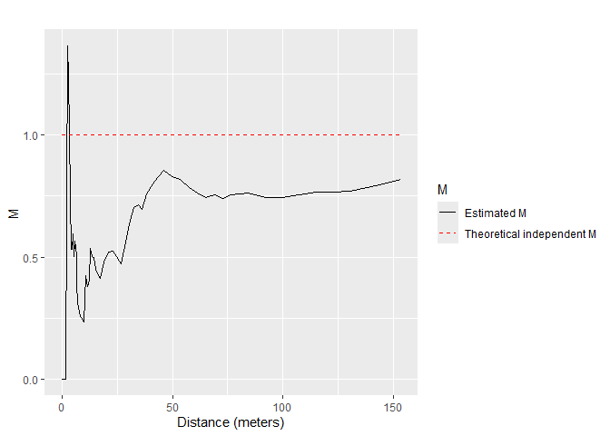
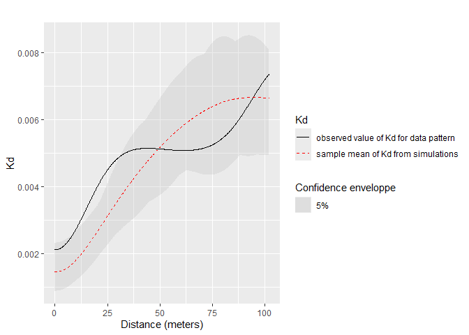
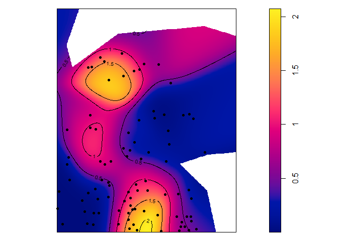

<!-- README.md is generated from README.Rmd. Please edit that file -->

# Distance Based Measures of Spatial Structures 

<!-- badges: start -->

[](https://CRAN.r-project.org/package=dbmss)
[](https://CRAN.R-project.org/package=dbmss)
[](https://CRAN.R-project.org/package=dbmss)

[](https://app.codecov.io/github/EricMarcon/dbmss)
[](https://www.codefactor.io/repository/github/ericmarcon/dbmss)
<!-- badges: end -->

dbmss is an R package for simple computation of spatial statistic
functions of distance to characterize the spatial structures of mapped
objects, including classical ones (Ripley’s *K* and others) and more
recent ones used by spatial economists (Duranton and Overman’s *Kd*,
Marcon and Puech’s *M*). It relies on spatstat for some core
calculation.

## Installation

You can install the current release of the package from CRAN or the
development version of dbmss from [GitHub](https://github.com/) with:

``` r
# install.packages("pak")
pak::pak("EricMarcon/dbmss")
```

## Main functions

The main functions of the package are designed to calculate
distance-based measures of spatial structure. Those are non-parametric
statistics able to summarize and test the spatial distribution
(concentration, dispersion) of points.

The classical, topographic functions such as Ripley’s *K* are provided
by the *spatstat* package and supported by *dbmss* for convenience.

Relative functions are available in *dbmss* only. These are the $M$ and
$m$ and $K_d$ functions.

The bivariate $M$ function can be calculated for *Q. Rosea* trees around
*V. Americana* trees:

``` r
library(dbmss)
autoplot(
  Mhat(
    paracou16, 
    ReferenceType = "V. Americana", 
    NeighborType = "Q. Rosea"
  ), 
  main = ""
)
```



## Confidence envelopes

Confidence envelopes of various null hypotheses can be calculated. The
univariate distribution of *Q. Rosea* is tested against the null
hypothesis of random location.

``` r
autoplot(
  KdEnvelope(paracou16, ReferenceType = "Q. Rosea", Global = TRUE), 
  main = ""
)
```



Significant concentration is detected between about 10 and 20 meters.

## Maps

Individual values of some distance-based measures can be computed and
mapped.

``` r
# Calculate individual intertype M(distance) value
ReferenceType <- "V. Americana"
NeighborType <- "Q. Rosea"
fvind <- Mhat(
  paracou16, 
  r = c(0, 30), 
  ReferenceType = ReferenceType, 
  NeighborType = NeighborType, 
  Individual = TRUE
)
# Plot the point pattern with values of M(30 meters)
p16_map <- Smooth(
  paracou16, 
  fvind = fvind, 
  distance = 30,
  # Resolution
  Nbx = 512, 
  Nby = 512
)
par(mar = rep(0, 4))
plot(p16_map, main = "")
# Add the reference points to the plot
is.ReferenceType <- marks(paracou16)$PointType == ReferenceType
points(
  x = paracou16$x[is.ReferenceType], 
  y = paracou16$y[is.ReferenceType], 
  pch = 20
)
# Add contour lines
contour(p16_map, nlevels = 5, add = TRUE)
```



## Vignettes

A quick [introduction](https://EricMarcon.github.io/dbmss/) is in
`vignette("dbmss")`.

A [full
documentation](https://ericmarcon.github.io/dbmss/articles/articles/reference.html)
is available on the package website. It is a continuous update of the
paper published in the Journal of Statistical Software ([Marcon et al.,
2015](https://doi.org/10.18637/jss.v067.c03)).

## Reference

Marcon, E., Traissac, S., Puech, F. and Lang, G. (2015). Tools to
Characterize Point Patterns: dbmss for R. *Journal of Statistical
Software*. 67(3): 1-15.
