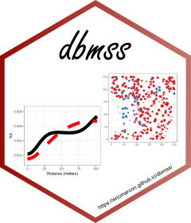

# Distance Based Measures of Spatial Structures 

 

dbmss is an R package for simple computation of spatial statistic functions of distance to characterize the spatial structures of mapped objects, including classical ones (Ripley's *K* and others) and more recent ones used by spatial economists (Duranton and Overman's *Kd*, Marcon and Puech's *M*). It relies on spatstat for some core calculation.

# Vignettes

A quick [introduction](https://EricMarcon.github.io/dbmss/) is in `vignette("dbmss")`.

A full documentation is available on the package website (Articles: Reference Guide).
It is a continuous update of the paper published in the Journal of Statistical Software ([Marcon et al., 2015](https://www.jstatsoft.org/article/view/v067c03)).

## Reference

Marcon, E., Traissac, S., Puech, F. and Lang, G. (2015). Tools to Characterize Point Patterns: dbmss for R. 
*Journal of Statistical Software*. 67(3): 1-15.
